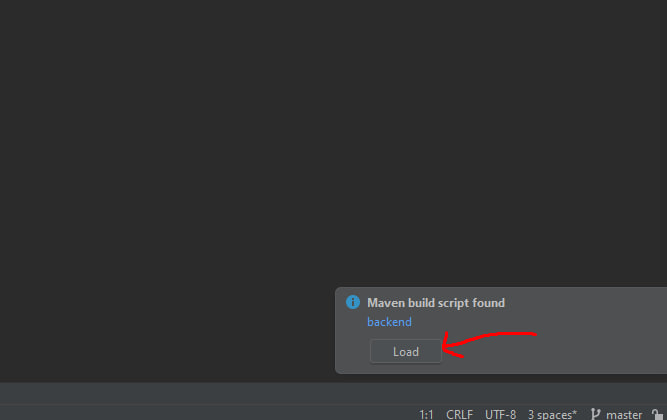

   Clone the repository: `git@github.com:fmIst0/note-management-api.git`.

   Don't forget to press the "Load" button
   
   

### Start Database
1. Ensure you have Docker installed on your system, open it.
2. Open terminal and run the application using Docker Compose with command: `docker-compose up -d`
3. Connect to the local DB using the IntelliJ IDEA interface, the port can be changed in the [.env](backend/.env) file `MYSQLDB_LOCAL_PORT=your port` (if needed)

   Credentials: username=`user`; password=`password`; Database=`note_management_db`; default_db_port=`3308`;
4. You can also check that the database is running with `docker-compose ps`.

   You can use `docker-compose down` command to stop the database running.

### Run API
1. Write `cd backend` command from the `/note-management` dir in terminal to get to the backend directory and build project with `mvn clean install`.
2. Run project with `mvn spring-boot:run` command in terminal.

To stop the execution press `Ctrl+C` in terminal 

### Run client app
1. Ensure you have node.js and npm installed on your system.
2. Open terminal and write the `cd frontend` command from the `/note-management` dir to get the frontend module.
3. Write `npm install` command to install all necessary dependencies for FE.
4. To run the client app enter the `npm start` command in terminal.

To stop execution press `Ctrl+C` in terminal

### Run test
Open terminal and write the `npm run test:cypress` command in the `/frontend` directory.